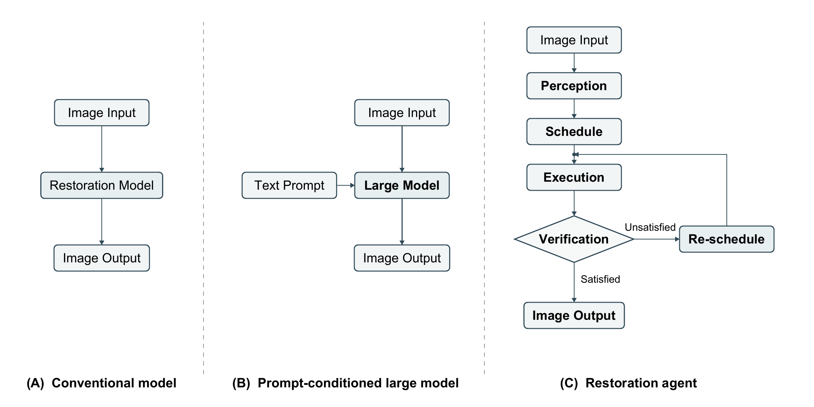
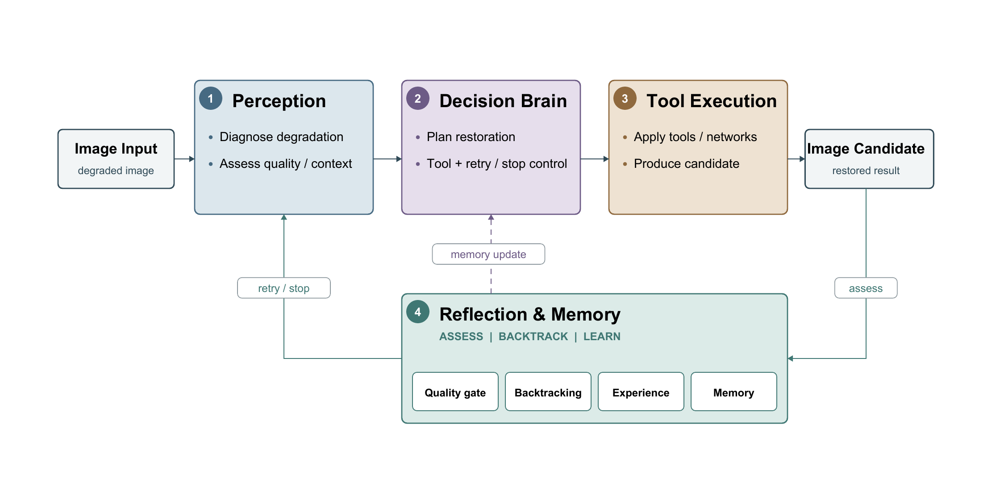
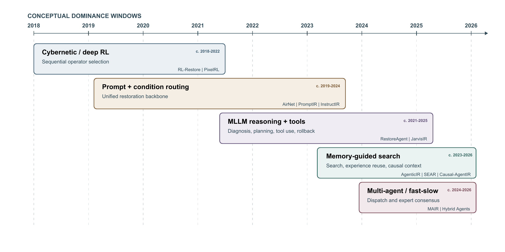

# Agentic Image Restoration

This repository provides supporting material for the paper **Agentic Image Restoration: A Structured Review**.

**Authors:** Yuezhe Yang, Chengru Li, Zhuodong Chai, Xingbo Dong, and Zhe Jin. Yuezhe Yang, Chengru Li, and Zhuodong Chai contributed equally to this work. Xingbo Dong is the corresponding author.

## Contents

- [Abstract](#abstract)
- [Highlights](#highlights)
- [Visual overview](#visual-overview)
- [Paper index](#paper-index)
- [Citation](#citation)

## Abstract

Multimodal foundation models and autonomous systems are extending image restoration from static forward mappings to closed-loop Agentic Image Restoration (AIR). Conventional CNN, Vision Transformer, and diffusion restorers follow predetermined inference procedures and usually lack explicit degradation diagnosis, runtime tool composition, output verification, or persistent experience. AIR introduces decision processes that observe intermediate states, select and execute restoration actions, assess the result, and may revise subsequent actions or memory. We review representative studies published from 2018 to 2026 and introduce a five-category controller taxonomy comprising Cybernetic Reinforcement Learning (P1), Prompt-Conditioned Restoration (P2), MLLM Reasoning and Tool Use (P3), Memory-Augmented Restoration Agents (P4), and Multi-Agent Restoration Systems (P5). A four-component anatomy of perception, decision, action, and reflection or memory provides an orthogonal descriptive framework. We synthesize evidence across natural photography, 4K super-resolution, autonomous driving, medical reconstruction, remote sensing, and scientific microscopy, followed by a protocol-aware discussion of benchmarks and evaluation.

The supporting material is available at [https://github.com/ahuteam/awesome-agentic-image-restoration](https://github.com/ahuteam/awesome-agentic-image-restoration).

## Highlights

- A four-component anatomy describes AIR systems through perception, decision, action, and reflection or memory.
- A five-category taxonomy distinguishes reinforcement-learning controllers, prompt-conditioned restoration, MLLM tool use, memory-augmented agents, and multi-agent systems.
- The paper index links each work to its publication record and to author-provided code or project pages when available.
- Quantitative results in the paper are reported within their original datasets, degradations, and evaluation protocols.
- Withdrawn or retracted records are removed after verification against the publisher or preprint record.

## Visual overview



### Four-component AIR anatomy



### Development timeline



## Paper index

Titles reproduce the linked publication records. The year column uses the year of the cited version of record or preprint and does not combine online-first and issue years.

### P1: Cybernetic and reinforcement-learning agents

| Work | Venue | Year | Paper | Code / project |
|---|---|---:|---|---|
| Intelligent Parameter Tuning in Optimization-Based Iterative CT Reconstruction via Deep Reinforcement Learning | IEEE TMI | 2018 | [Paper](https://doi.org/10.1109/TMI.2018.2823679) | [Code](https://github.com/heixscy88/TMI_parameter_tuning) |
| Crafting a Toolchain for Image Restoration by Deep Reinforcement Learning | CVPR | 2018 | [Paper](https://openaccess.thecvf.com/content_cvpr_2018/html/Yu_Crafting_a_Toolchain_CVPR_2018_paper.html) | [Code](https://github.com/yuke93/RL-Restore) |
| Distort-and-Recover: Color Enhancement using Deep Reinforcement Learning | CVPR | 2018 | [Paper](https://openaccess.thecvf.com/content_cvpr_2018/html/Park_Distort-and-Recover_Color_Enhancement_CVPR_2018_paper.html) | — |
| Fully Convolutional Network with Multi-Step Reinforcement Learning for Image Processing | AAAI | 2019 | [Paper](https://doi.org/10.1609/aaai.v33i01.33013598) | [Code](https://github.com/rfuruta/pixelRL) |
| Low Dose CT Denoising via Joint Bilateral Filtering and Intelligent Parameter Optimization | CT Meeting | 2020 | [Paper](https://arxiv.org/abs/2007.04768) | — |
| Path-Restore: Learning Network Path Selection for Image Restoration | IEEE TPAMI | 2022 | [Paper](https://doi.org/10.1109/TPAMI.2021.3080863) | [Code](https://github.com/yuke93/Path-Restore) |
| Dual states based reinforcement learning for fast MR scan and image reconstruction | Neurocomputing | 2024 | [Paper](https://doi.org/10.1016/j.neucom.2023.127067) | [Code](https://github.com/yanweipang/mri) |
| Intelligent Agent Planning for Optimizing Parallel MRI Reconstruction via a Large Language Model | EMBC | 2024 | [Paper](https://doi.org/10.1109/EMBC53108.2024.10782629) | — |
| A Reinforcement Learning Approach for Optimized MRI Sampling with Region-Specific Fidelity | Neurocomputing | 2025 | [Paper](https://doi.org/10.1016/j.neucom.2025.130116) | [Code](https://github.com/Ruru-Xu/KSRO) |
| PaAgent: Portrait-Aware Image Restoration Agent via Subjective-Objective Reinforcement Learning | arXiv | 2026 | [Paper](https://arxiv.org/abs/2603.17055) | — |
| Restore-R1: Efficient Image Restoration Agents via Reinforcement Learning with Multimodal LLM Perceptual Feedback | CVPR Findings | 2026 | [Paper](https://openaccess.thecvf.com/content/CVPR2026F/html/Lu_Restore-R1_Efficient_Image_Restoration_Agents_via_Reinforcement_Learning_with_Multimodal_CVPRF_2026_paper.html) | — |

### P2: Prompt-conditioned restoration

| Work | Venue | Year | Paper | Code / project |
|---|---|---:|---|---|
| All-in-One Image Restoration for Unknown Corruption | CVPR | 2022 | [Paper](https://openaccess.thecvf.com/content/CVPR2022/html/Li_All-in-One_Image_Restoration_for_Unknown_Corruption_CVPR_2022_paper.html) | [Code](https://github.com/XLearning-SCU/2022-CVPR-AirNet) |
| PromptIR: Prompting for All-in-One Image Restoration | NeurIPS | 2023 | [Paper](https://proceedings.neurips.cc/paper_files/paper/2023/hash/e187897ed7780a8c3f50a8fc8997e6b1-Abstract-Conference.html) | [Code](https://github.com/va1shn9v/PromptIR) |
| InstructIR: High-Quality Image Restoration Following Human Instructions | ECCV | 2024 | [Paper](https://arxiv.org/abs/2401.16468) | [Code](https://github.com/mv-lab/InstructIR) |
| Controlling Vision-Language Models for Multi-Task Image Restoration | ICLR | 2024 | [Paper](https://openreview.net/forum?id=HBA5UGjv7r) | [Code](https://github.com/Algolzw/daclip-uir) |
| AutoDIR: Automatic All-in-One Image Restoration with Latent Diffusion | ECCV | 2024 | [Paper](https://arxiv.org/abs/2310.10123) | [Code](https://github.com/jiangyitong/AutoDIR) |
| OneRestore: A Universal Restoration Framework for Composite Degradation | ECCV | 2024 | [Paper](https://arxiv.org/abs/2407.04621) | [Code](https://github.com/gy65896/OneRestore) |

### P3: MLLM reasoning and tool use

| Work | Venue | Year | Paper | Code / project |
|---|---|---:|---|---|
| Clarity ChatGPT: An Interactive and Adaptive Processing System for Image Restoration and Enhancement | arXiv | 2023 | [Paper](https://arxiv.org/abs/2311.11695) | — |
| RestoreAgent: Autonomous Image Restoration Agent via Multimodal Large Language Models | NeurIPS | 2024 | [Paper](https://proceedings.neurips.cc/paper_files/paper/2024/hash/c78f639424b8d89ceb4f2efbb4dfe4f4-Abstract.html) | [Project](https://haoyuchen.com/RestoreAgent) |
| JarvisIR: Elevating Autonomous Driving Perception with Intelligent Image Restoration | CVPR | 2025 | [Paper](https://openaccess.thecvf.com/content/CVPR2025/html/Lin_JarvisIR_Elevating_Autonomous_Driving_Perception_with_Intelligent_Image_Restoration_CVPR_2025_paper.html) | [Code](https://github.com/LYL1015/JarvisIR) |
| 4KAgent: Agentic Any Image to 4K Super-Resolution | NeurIPS | 2025 | [Paper](https://proceedings.neurips.cc/paper_files/paper/2025/hash/f0075fe4e59652cf43148dcfab8d3c93-Abstract-Conference.html) | [Code](https://github.com/taco-group/4KAgent) |
| Q-Agent: Quality-Driven Chain-of-Thought Image Restoration Agent through Robust Multimodal Large Language Model | arXiv | 2025 | [Paper](https://arxiv.org/abs/2504.07148) | — |
| AgentMRI: A Vison Language Model-Powered AI System for Self-regulating MRI Reconstruction with Multiple Degradations | JIIM | 2026 | [Paper](https://doi.org/10.1007/s10278-025-01617-0) | — |
| Restore, Assess, Repeat: A Unified Framework for Iterative Image Restoration | CVPR | 2026 | [Paper](https://openaccess.thecvf.com/content/CVPR2026/html/Chen_Restore_Assess_Repeat_A_Unified_Framework_for_Iterative_Image_Restoration_CVPR_2026_paper.html) | [Code](https://github.com/saic-fi/RAR) |
| EpiAgent: An Agent-Centric System for Ancient Inscription Restoration | CVPR | 2026 | [Paper](https://openaccess.thecvf.com/content/CVPR2026/html/Zhu_EpiAgent_An_Agent-Centric_System_for_Ancient_Inscription_Restoration_CVPR_2026_paper.html) | [Code](https://github.com/blackprotoss/EpiAgent) |
| SIMBA: An Agentic AI Platform for Single-Molecule Multi-Dimensional Imaging | bioRxiv | 2026 | [Paper](https://doi.org/10.64898/2026.04.16.719005) | — |
| FAPE-IR: Frequency-Aware Planning and Execution Framework for All-in-One Image Restoration | CVPR | 2026 | [Paper](https://openaccess.thecvf.com/content/CVPR2026/html/Liu_FAPE-IR_Frequency-Aware_Planning_and_Execution_Framework_for_All-in-One_Image_Restoration_CVPR_2026_paper.html) | [Code](https://github.com/Programmergg/FAPE-IR) |
| OPERA: An Agent for Image Restoration with End-to-End Joint Planning–Execution Optimization | arXiv | 2026 | [Paper](https://arxiv.org/abs/2605.22104) | [Code](https://github.com/xsyshuishui/Opera) |
| DiTTo: Scalable Order-Aware All-in-One Image Restoration Agent | arXiv | 2026 | [Paper](https://arxiv.org/abs/2605.30915) | [Project](https://cmlab-korea.github.io/DiTTo/) |

### P4: Memory-augmented restoration agents

| Work | Venue | Year | Paper | Code / project |
|---|---|---:|---|---|
| An Intelligent Agentic System for Complex Image Restoration Problems | ICLR | 2025 | [Paper](https://proceedings.iclr.cc/paper_files/paper/2025/hash/921ac785fa9edc73cacaf2664f43d234-Abstract-Conference.html) | [Code](https://github.com/Kaiwen-Zhu/AgenticIR) |
| Self-Evolving Agentic Image Restoration via Deliberate Planning and Intuitive Execution | arXiv | 2026 | [Paper](https://arxiv.org/abs/2606.28971) | — |
| Causal-AgentIR: Self-Evolving Causal Memory for Adaptive Image Restoration Agents | arXiv | 2026 | [Paper](https://arxiv.org/abs/2607.21125) | — |

### P5: Multi-agent restoration systems

| Work | Venue | Year | Paper | Code / project |
|---|---|---:|---|---|
| Multi-Agent Image Restoration | IJCV | 2026 | [Paper](https://doi.org/10.1007/s11263-026-02792-5) | [Project](https://villa.jianzhang.tech/publication/200604/) |
| Hybrid Agents for Image Restoration | CVPR | 2026 | [Paper](https://openaccess.thecvf.com/content/CVPR2026/html/Li_Hybrid_Agents_for_Image_Restoration_CVPR_2026_paper.html) | — |
| MAPGR: Multi-Agent Prompt-Guided Residual Diffusion for Ancient Mural Restoration | npj Heritage Science | 2026 | [Paper](https://doi.org/10.1038/s40494-026-02607-3) | [Code](https://github.com/tiskun101-oss/MAPGR) |
| CLEAR: A Cognitive LLM-Empowered Adaptive Restoration Framework for Robust Ship Detection in Complex Maritime Scenarios | Remote Sensing | 2026 | [Paper](https://doi.org/10.3390/rs18081142) | — |

### Domain extensions and evaluation suites

| Work | Venue | Year | Paper | Code / project |
|---|---|---:|---|---|
| Self-Explained Thinking Agent for Autonomous Microscopy Restoration | Research Square | 2025 | [Paper](https://doi.org/10.21203/rs.3.rs-7116422/v1) | — |
| RIR-Agent: An Interactive Framework for Effective and Adaptive Restoration of Remote Sensing Imagery | Expert Systems with Applications | 2026 | [Paper](https://doi.org/10.1016/j.eswa.2026.132495) | [Code](https://github.com/Arispur-311/RIR-Agent) |
| Does AI Understand Imaging? A Systematic Benchmark of Agentic AI for Computational Imaging Tasks | arXiv | 2026 | [Paper](https://arxiv.org/abs/2607.07189) | — |
| Imaging-101: Benchmarking LLM Coding Agents on Scientific Computational Imaging | arXiv | 2026 | [Paper](https://arxiv.org/abs/2607.10789) | [Code](https://github.com/AI4ImagingLab/imaging-101-release) |
| Agentic Autoresearch for CT Reconstruction | arXiv | 2026 | [Paper](https://arxiv.org/abs/2607.22824) | — |
| Prompt-Agent-Driven Integration of Foundation Model Priors for Low-Count PET Reconstruction | IEEE TMI | 2025 | [Paper](https://doi.org/10.1109/TMI.2025.3527155) | — |
| PhotoAgent: Exploratory Visual Aesthetic Planning with Large Vision Models | arXiv | 2026 | [Paper](https://arxiv.org/abs/2602.22809) | [Code](https://github.com/mdyao/PhotoAgent) |
| PhotoArtAgent: Intelligent Photo Retouching with Language Model-Based Artist Agents | arXiv | 2025 | [Paper](https://arxiv.org/abs/2505.23130) | — |
| RetouchIQ: MLLM Agents for Instruction-Based Image Retouching with Generalist Reward | CVPR | 2026 | [Paper](https://openaccess.thecvf.com/content/CVPR2026/html/Wu_RetouchIQ_MLLM_Agents_for_Instruction-Based_Image_Retouching_with_Generalist_Reward_CVPR_2026_paper.html) | — |

## Citation

Citation metadata will be updated when the paper receives a permanent publication record.

```bibtex
@misc{yang2026agenticrestoration,
  title  = {Agentic Image Restoration: A Structured Review},
  author = {Yang, Yuezhe and Li, Chengru and Chai, Zhuodong and Dong, Xingbo and Jin, Zhe},
  year   = {2026},
  note   = {Manuscript}
}
```

## Acknowledgements

This work was supported by the National Natural Science Foundation of China (Grant No. 62306003).
